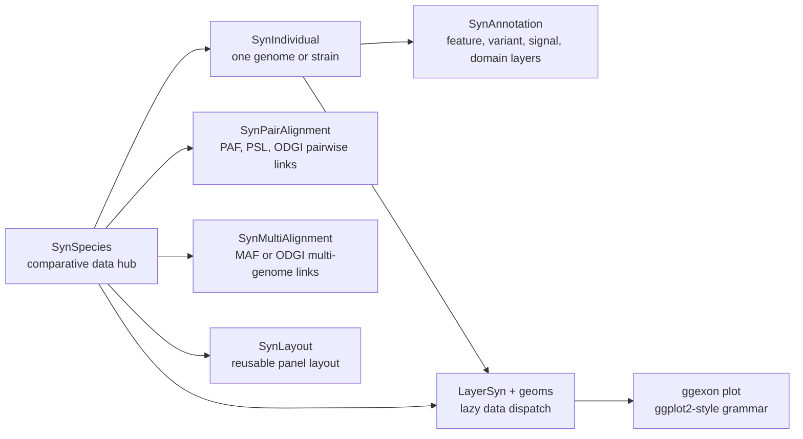

# ggexon

**Grammar of genomic annotations, synteny, and associated data.**

`ggexon` is a ggplot2 extension for drawing genomic annotation together with
comparative and track-level data. It was developed while visualizing the
`sept-1`/`zina-1` toxin-antidote locus described in the preprint
[sept-1/zina-1 is an Ancient Toxin-Antidote System in Caenorhabditis elegans](https://www.biorxiv.org/content/10.1101/2025.11.28.691152v1).

The goal is simple: if you already think in `ggplot2`, you should not need to
learn a completely new plotting language just because your x-axis is a genome.

## S4 Verb Families

`ggexon` is not only a collection of plotting geoms. It is also an S4 object
system with verb families that follow one shared rule: the same high-level verb
should work on the layer object itself and on larger containers that hold that
layer.

Three families matter most:

- `add_*()` attaches child objects or annotation layers to the Syn object that
  owns them.
- `load_*()` materializes data into a Syn object while preserving the top-level
  class of the input.
- `subset_*()` trims a Syn object to a genomic or alignment window and, in most
  cases, also preserves the top-level class of the input.

This means you can think in terms of biological intent rather than class
plumbing. If you want to load an annotation layer, you can call
`load_annotation()` on a `SynFeatureAnnotation`, a `SynIndividual`, or a
`SynSpecies`. If you want to subset a feature annotation, you can call
`subset_feature_annotation()` on the annotation itself, on the individual that
contains it, or on the species-level container that contains that individual.

The complementary rule is that extractor helpers such as
`pairwise_alignment_data()` still return tabular data, while object verbs such
as `subset_pairwise_alignment()` now return updated Syn objects. In other
words:

- `*_data()` answers "give me the rows"
- `add_*()` answers "store this child object or layer"
- `load_*()` answers "load this into the object"
- `subset_*()` answers "keep this window inside the object"

This separation is important because it lets README examples, interactive
analysis, and plotting code all use the same grammar without repeatedly
unpacking and repacking intermediate objects.

## Generic Tutorial

Below are the most important generic-dispatch patterns.

### 1. `add_*()` builds the object graph

`SynSpecies` works as the project-level data hub. It stores `SynIndividual`
children, while each `SynIndividual` stores its own annotation layers. The
`add_*()` verbs are S4 generics, so the same verb name can do different work
depending on the classes of the input objects.

```r
xz <- SynIndividual(
  annotation_file = "XZ1516.gff3",
  genome_file = genome_waiver(),
  id = "XZ1516"
)

n2 <- SynIndividual(
  annotation_file = "N2.gff3",
  genome_file = genome_waiver(),
  id = "N2"
)

sp <- SynSpecies(name = "worms") |>
  add_individual(xz, n2)

sp <- add_pairwise_alignment(
  sp,
  SynPairAlignment(
    name = "XZ1516_vs_N2",
    query_individual = "XZ1516",
    target_individual = "N2",
    file = "XZ1516_vs_N2.paf"
  )
)
```

Annotation layers are attached to the object that owns them. For example, a
protein-mutation table can be added to one individual:

```r
xz <- add_protein_mutation_annotation(
  xz,
  mutation_file = "mutation_counts.tsv"
)
```

Or to the species hub. If the table contains a strain/species/id column,
`add_protein_mutation_annotation()` routes rows to the matching individuals.
Missing individuals can be created as annotation-only children when
`create_missing = TRUE`.

```r
sp <- add_protein_mutation_annotation(
  sp,
  mutation_file = "mutation_counts.tsv",
  individual_col = "auto",
  all = TRUE,
  create_missing = TRUE
)
```

This pattern keeps plotting code clean: the plot can receive a `SynSpecies`
object and the geoms can resolve the relevant child data at build time.

### 2. `load_annotation()` works at three levels

```r
ann <- SynFeatureAnnotation(
  name = "default",
  annotation_file = "XZ1516.gff3"
)
ann <- load_annotation(ann)

ind <- SynIndividual(
  annotation_file = "XZ1516.gff3",
  genome_file = genome_waiver(),
  id = "XZ1516"
)
ind <- load_annotation(ind)

sp <- SynSpecies(name = "worms") |>
  add_individual(ind)
sp <- load_annotation(sp)
```

Use `annotation =` and `individual =` when you want to target a contained
object through its parent container:

```r
sp <- load_annotation(
  sp,
  individual = "XZ1516",
  annotation = "default"
)
```

### 3. `subset_feature_annotation()` keeps the same outer shape

```r
ann_small <- subset_feature_annotation(
  ann,
  chr = "V_RagTag",
  start = 21574445,
  end = 21584356
)
```

The same verb can be applied to a `SynIndividual`:

```r
ind_small <- subset_feature_annotation(
  ind,
  chr = "V_RagTag",
  start = 21574445,
  end = 21584356
)
```

Or to a `SynSpecies` when you also specify which individual to traverse:

```r
sp_small <- subset_feature_annotation(
  sp,
  individual = "XZ1516",
  chr = "V_RagTag",
  start = 21574445,
  end = 21584356
)
```

The return type matches the input:

- `SynFeatureAnnotation` in, `SynFeatureAnnotation` out
- `SynIndividual` in, `SynIndividual` out
- `SynSpecies` in, `SynSpecies` out

### 4. `subset_individual()` and `subset_species()` are container verbs

If you already know you want an individual back, use `subset_individual()`:

```r
ind_window <- subset_individual(
  ind,
  chr = "V_RagTag",
  start = 21574445,
  end = 21584356
)
```

If the input is a `SynSpecies`, the same generic can resolve the contained
individual first:

```r
ind_window <- subset_individual(
  sp,
  individual = "XZ1516",
  chr = "V_RagTag",
  start = 21574445,
  end = 21584356
)
```

If you want to keep the whole species object and trim one or more individuals
inside it, use `subset_species()`:

```r
sp_window <- subset_species(
  sp,
  coords = c("XZ1516#V_RagTag:21574445-21584356")
)
```

### 5. Pairwise alignments now follow the same object grammar

Use `pairwise_alignment_data()` when you want extracted link rows:

```r
paf <- pairwise_alignment_data(
  sp,
  alignment = "XZ1516_vs_N2",
  subset = c(
    XZ1516 = "RagTag_V:21574445-21584356",
    N2 = "V:20456000-20465040"
  )
)
```

Use `subset_pairwise_alignment()` when you want to update the object itself:

```r
pair <- subset_pairwise_alignment(
  pair,
  subset = c(XZ1516 = "RagTag_V")
)
```

Or update the stored alignment inside a `SynSpecies`:

```r
sp <- subset_pairwise_alignment(
  sp,
  alignment = "XZ1516_vs_N2",
  subset = c(
    XZ1516 = "RagTag_V:21574445-21584356",
    N2 = "V:20456000-20465040"
  )
)
```

The same idea applies to filtering:

```r
sp <- filter_pairwise_alignment(
  sp,
  alignment = "XZ1516_vs_N2",
  filter = 200
)
```

### 6. A practical rule of thumb

When deciding which helper to call:

- use `load_*()` when the object knows where the file is, but has not yet
  materialized the data
- use `add_*()` when you want a Syn object to remember a child individual,
  alignment, or annotation layer
- use `subset_*()` when you want a reusable windowed Syn object
- use `*_data()` or `query_*()` when you only want extracted tables or ranges

After those object verbs prepare the data, the plotting side still looks like
ordinary `ggplot2` code:

```r
library(ggexon)

ggexon(sp) +
  geom_gene(
    species = c("XZ1516", "N2"),
    reference = "XZ1516",
    chr = "RagTag_V",
    subset = c(21574445, 21584356),
    alignment = "XZ1516_vs_N2"
  ) +
  geom_nuclink(
    reference = "XZ1516",
    chr = "RagTag_V",
    subset = c(21574445, 21584356),
    alignment = "XZ1516_vs_N2"
  ) +
  facet_genomics(ggplot2::vars(track), scales = "free_y")
```

## Why ggexon?

Most ggplot2-style genome plotting packages start from a data frame: prepare a
table, map columns, draw a layer. That is powerful, but comparative genomics
quickly becomes a filing-cabinet problem. A plot may need several genome
annotations, local gene-model corrections, VCFs, BigWigs, protein domains, PAF
or PSL alignments, ODGI graph-derived links, and a layout that keeps all of
those pieces synchronized.

`ggexon` keeps the ggplot2 grammar, but moves genomic data management into a
small object model:

- `SynSpecies` is the project-level data hub. It holds individuals, pairwise or
  multiple alignments, metadata, and optional reusable layouts.
- `SynIndividual` is one genome or strain. It owns the FASTA/GFF or GTF paths,
  loaded annotations, feature indexes, sequences, labels, patches, and
  individual-level annotation layers.
- `SynAnnotation` subclasses describe specific data layers, such as structural
  features, variants, BigWig signal, and protein domains.
- Syn-aware geoms such as `geom_exon()`, `geom_gene()`, `geom_genelabel()`,
  `geom_motif()`, and `geom_nuclink()` can dispatch from those objects at plot
  build time.

In other words, `SynSpecies` remembers where the data live, while the layer
functions decide what slice of the data is needed for the current plot.

## Installation

`ggexon` is currently a development package.

```r
install.packages("remotes")
remotes::install_github("DongyaoLiu/ggexon")
```

Some dependencies are from Bioconductor. If your R installation cannot resolve
them automatically, install them first:

```r
install.packages("BiocManager")
BiocManager::install(c(
  "Biostrings",
  "GenomeInfoDb",
  "GenomicRanges",
  "Rsamtools",
  "rtracklayer"
))
```

For ODGI-backed graph alignment workflows, install the system tools listed in
`DESCRIPTION`:

- Python 3.8 or newer
- `odgi`

## Core Data Classes



### `SynIndividual`

Use `SynIndividual` when you want to register one genome or strain.

```r
x <- SynIndividual(
  genome_file = "XZ1516.fasta",
  annotation_file = "caenorhabditis_XZ1516.gff3",
  id = "XZ1516"
)

x <- load_annotation(x)
```

A `SynIndividual` can store:

- structural annotations from GFF/GTF files
- extracted CDS nucleotide sequences
- translated protein sequences
- feature indexes for fast lookup
- readable gene labels for plotting
- patch history for corrected gene models
- additional layers such as VCF, BigWig, and protein-domain annotations

### `SynAnnotation`

`SynAnnotation` is the shared base class for data layers. The main concrete
annotation classes are:

- `SynFeatureAnnotation`: genes, transcripts, exons, CDS, labels, and patches
- `SynVCFAnnotation`: variant data queried by genomic region
- `SynBigWigAnnotation`: signal tracks queried by genomic region
- `SynProteinDomainAnnotation`: protein-space domains from InterProScan-like
  tables
- `SynAnnotationPatch`: small gene-model corrections that can replace, add, or
  drop features

Example:

```r
x <- add_annotation(
  x,
  SynVCFAnnotation(
    name = "variants",
    vcf_file = "sample.vcf.gz"
  )
)

variant_layer <- get_annotation(x, "variants")
query_variants(variant_layer, chr = "V_RagTag", start = 21574336, end = 21574450)
```

### `SynSpecies`

`SynSpecies` is the object that makes comparative plotting feel less like
bookkeeping. It collects genomes and stores the relationships between them.

```r
sp <- SynSpecies(name = "Caenorhabditis")
sp <- add_individual(sp, x)
sp <- add_individual(sp, n2)

sp <- add_pairwise_alignment(
  sp,
  SynPairAlignment(
    name = "XZ1516_vs_N2",
    query_individual = "XZ1516",
    target_individual = "N2",
    file = "XZ1516_vs_N2.paf"
  )
)
```

`SynSpecies` can also be initialized from a folder of annotation files:

```r
sp <- SynSpecies(
  name = "Caenorhabditis",
  annotation_folder = "annotations/",
  annotation_format = "gff"
)
```

### Alignment Classes

Comparative links are stored above individual genomes:

- `SynPairAlignment` stores one pairwise relationship between two individuals.
  Supported formats include PAF, PSL, and ODGI-derived pairwise links.
- `SynMultiAlignment` stores one multi-genome alignment. Supported formats
  include MAF and ODGI.

This design lets a plotting layer ask a higher-level question, such as
"draw the links around this reference window", instead of forcing the user to
precompute every polygon by hand.

## Plotting Grammar

`ggexon()` starts a plot just like `ggplot()`, but it understands
`SynIndividual` and `SynSpecies` objects.

```r
ggexon(sp) +
  geom_exon(
    species = "XZ1516",
    chr = "RagTag_V",
    subset = c(21550000, 21680000)
  )
```

Use different geoms for different biological views:

- `geom_exon()` keeps exon-level transcript structure.
- `geom_gene()` collapses each gene to a directional span.
- `geom_genelabel()` draws readable gene labels without changing stable IDs.
- `geom_motif()` draws motif/domain-like intervals.
- `geom_nuclink()` draws nucleotide-level links between genomes.
- `facet_genomics()` arranges annotation panels and intermediate link panels.

The important trick is lazy dispatch. A layer can receive `sp`, plus a
reference species, chromosome, and coordinate window. During plot building,
`ggexon` resolves the relevant annotation rows, alignment links, default
aesthetic mappings, and panel metadata.

## Data Management Workflow

A typical project looks like this:

```r
library(ggexon)

x <- SynIndividual("XZ1516.fasta", "XZ1516.gff3", id = "XZ1516")
x <- load_annotation(x)

x <- set_gene_labels(
  x,
  c(FUN_000001 = "sept-1", FUN_000002 = "zina-1")
)

x <- patch_annotation_from_gff(
  x,
  patch_file = "XZ1516.corrected.gff3",
  mode = "replace",
  name = "manual-curation"
)

x <- translate_protein(x, genes = c("FUN_000001", "FUN_000002"))

sp <- SynSpecies(name = "Caenorhabditis")
sp <- add_individual(sp, x)
sp <- add_individual(sp, n2)
sp <- add_pairwise_alignment(sp, SynPairAlignment(
  name = "XZ1516_vs_N2",
  query_individual = "XZ1516",
  target_individual = "N2",
  file = "XZ1516_vs_N2.paf"
))

ggexon(sp) +
  geom_gene(
    species = c("XZ1516", "N2"),
    reference = "XZ1516",
    chr = "RagTag_V",
    subset = c(21574445, 21584356),
    alignment = "XZ1516_vs_N2"
  ) +
  facet_genomics(ggplot2::vars(track), scales = "free_y")
```

## Learn More

After installation, see the package vignettes:

```r
vignette("ggexon-workflow", package = "ggexon")
vignette("ggexon-classes-and-verbs", package = "ggexon")
```

If you use `ggexon` in work, please also cite the preprint:

> Liu D, Zheng C. sept-1/zina-1 is an Ancient Toxin-Antidote System in
> Caenorhabditis elegans. bioRxiv. 2025.
> <https://www.biorxiv.org/content/10.1101/2025.11.28.691152v1>
