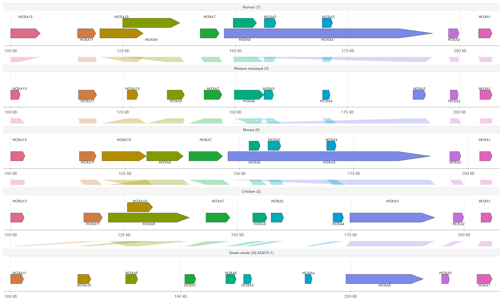

# ggexon

**Grammar of genomic annotations, synteny, and associated data.**

`ggexon` is a ggplot2 extension for drawing genomic annotation together with
comparative and track-level data. It was developed while visualizing the
`sept-1`/`zina-1` toxin-antidote locus described in the preprint
[sept-1/zina-1 is an Ancient Toxin-Antidote System in Caenorhabditis elegans](https://www.biorxiv.org/content/10.1101/2025.11.28.691152v1).

The package has two connected parts:

1. S4 classes store genomes, annotation layers, alignments, and reusable layout
   state.
2. Functions load, query, modify, and draw those classes with a ggplot2-style
   grammar.

If you already think in `ggplot2`, the goal is that genomic coordinates,
annotation tracks, alignments, and tree-aligned panels can all be composed with
familiar plotting ideas.

## Flagship HOXA Example



The bundled HOXA demo uses Ensembl release 115 annotations to show how ggexon
can present a conserved gene cluster across distant vertebrates. Gene intervals
are drawn with `geom_genetag()`, while orthology/synteny ribbons are drawn with
`geom_synteny_link()`. The example is intentionally plot-ready, so users can
inspect the data tables, see the complete code, and adapt the same grammar to
their own comparative-genomics datasets. It also demonstrates two layout
problems that appear in real genome annotations: compact multi-panel synteny
links and overlapping or nested gene spans.

Open `vignette("hoxa-ensembl115-demo", package = "ggexon")` for the full
example, data provenance, and a short explanation of how link panels are built
internally.

## Installation

`ggexon` is currently a development package.

```r
install.packages("remotes")
remotes::install_github("DongyaoLiu/ggexon")
```

Some dependencies are from Bioconductor. If your R installation cannot resolve
them automatically, install them first:

```r
install.packages("BiocManager")
BiocManager::install(c(
  "Biostrings",
  "GenomeInfoDb",
  "GenomicRanges",
  "Rsamtools",
  "rtracklayer"
))
```

For ODGI-backed graph alignment workflows, install the system tools listed in
`DESCRIPTION`:

- Python 3.8 or newer
- `odgi`

## Package Map

### Part 1: Classes Store Data

The core data containers are:

| Class | Role |
| --- | --- |
| `SynSpecies` | Project-level container for individuals, alignments, trees, and layout state |
| `SynIndividual` | One genome, strain, species, or sample |
| `SynFeatureAnnotation` | Genes, transcripts, exons, CDS, labels, and annotation patches |
| `SynVCFAnnotation` | Variant data queried by genomic interval |
| `SynBigWigAnnotation` | Signal tracks queried by genomic interval |
| `SynProteinDomainAnnotation` | Protein-domain intervals from InterProScan-like tables |
| `SynProteinMutationAnnotation` | Protein mutation summaries for lollipop-style tracks |
| `HomologyAnnotation` | Cross-species gene homology mappings from BLAST results |
| `SynPairAlignment` | Pairwise genome links from PAF, PSL, or ODGI-derived data |
| `SynMultiAlignment` | Multi-genome alignment links from MAF or ODGI-backed data |
| `SynLayout` | Stored panel windows and layout decisions |

### Part 2: Functions Manipulate and Draw Classes

The public API is organized around a few function families:

| Task | Main functions |
| --- | --- |
| Build object graphs | `add_individual()`, `add_annotation()`, `add_homology_annotation()`, `add_pairwise_alignment()`, `add_multiple_alignment()`, `add_tree()` |
| Load and query data | `load_annotation()`, `load_alignment()`, `import_blast_homology()`, `query_features()`, `query_variants()`, `query_signal()`, `query_domains()` |
| Derive sequence/protein data | `extract_cds_seq()`, `translate_protein()`, `project_domains_to_genome()` |
| Subset and curate objects | `subset_species()`, `subset_individual()`, `subset_pairwise_alignment()`, `set_gene_labels()`, `patch_annotation_from_gff()` |
| Draw genomic layers | `ggexon()`, `geom_exon()`, `geom_genetag()`, `geom_genelabel()`, `geom_nuclink()`, `geom_synteny_link()`, `geom_protein_lollipop()` |
| Arrange panels and guides | `facet_genomics()`, `facet_genomictree()`, `scale_x_ggexon_genomic()`, `guide_x_ggexon_piecewise()` |

The typical workflow is:

```r
library(ggexon)

x <- SynIndividual(
  genome_file = "genome.fasta",
  annotation_file = "annotation.gff3",
  id = "sample"
)

sp <- SynSpecies(name = "project") |>
  add_individual(x)

ggexon(sp) +
  geom_exon(species = "sample", chr = "chr1")
```

## Learn More

The package site contains the longer cookbook-style documentation:

- `vignette("ggexon-classes-and-verbs", package = "ggexon")` for the class
  model, every geom, facet systems, and the genomic guide.
- `vignette("ggexon-workflow", package = "ggexon")` for a step-by-step workflow
  using individuals, annotations, alignments, and direct plotting.
- `vignette("hoxa-ensembl115-demo", package = "ggexon")` for a curated
  Ensembl 115 HOXA/Hoxa synteny demo using `geom_synteny_link()`.
- `?ggexon` and the reference index for function-level documentation.

If you use `ggexon` in work, please also cite the preprint:

> Liu D, Zheng C. sept-1/zina-1 is an Ancient Toxin-Antidote System in
> Caenorhabditis elegans. bioRxiv. 2025.
> <https://www.biorxiv.org/content/10.1101/2025.11.28.691152v1>
