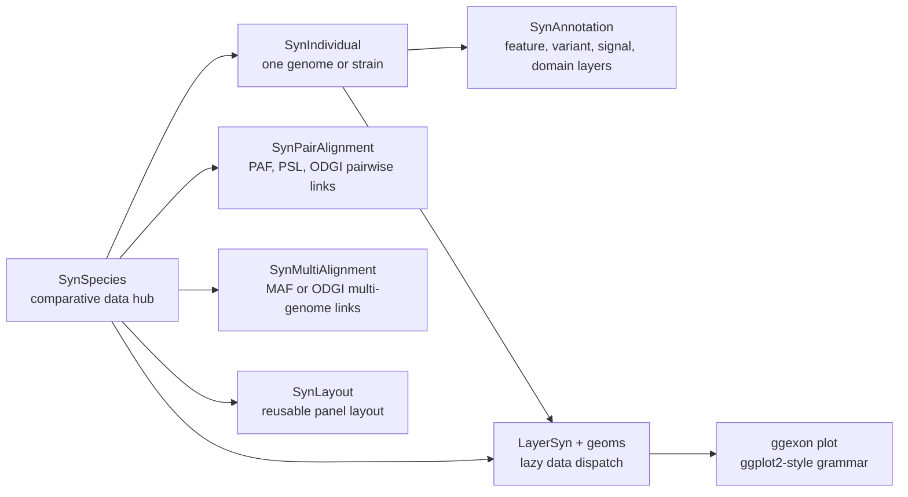

# ggexon

**Grammar of genomic annotations, synteny, and associated data.**

`ggexon` is a ggplot2 extension for drawing genomic annotation together with
comparative and track-level data. It was developed while visualizing the
`sept-1`/`zina-1` toxin-antidote locus described in the preprint
[sept-1/zina-1 is an Ancient Toxin-Antidote System in Caenorhabditis elegans](https://www.biorxiv.org/content/10.1101/2025.11.28.691152v1).

The goal is simple: if you already think in `ggplot2`, you should not need to
learn a completely new plotting language just because your x-axis is a genome.

```r
library(ggexon)

ggexon(sp) +
  geom_gene(
    species = c("XZ1516", "N2"),
    reference = "XZ1516",
    chr = "RagTag_V",
    subset = c(21574445, 21584356),
    alignment = "XZ1516_vs_N2"
  ) +
  geom_nuclink(
    reference = "XZ1516",
    chr = "RagTag_V",
    subset = c(21574445, 21584356),
    alignment = "XZ1516_vs_N2"
  ) +
  facet_genomics(ggplot2::vars(track), scales = "free_y")
```

## Why ggexon?

Most ggplot2-style genome plotting packages start from a data frame: prepare a
table, map columns, draw a layer. That is powerful, but comparative genomics
quickly becomes a filing-cabinet problem. A plot may need several genome
annotations, local gene-model corrections, VCFs, BigWigs, protein domains, PAF
or PSL alignments, ODGI graph-derived links, and a layout that keeps all of
those pieces synchronized.

`ggexon` keeps the ggplot2 grammar, but moves genomic data management into a
small object model:

- `SynSpecies` is the project-level data hub. It holds individuals, pairwise or
  multiple alignments, metadata, and optional reusable layouts.
- `SynIndividual` is one genome or strain. It owns the FASTA/GFF or GTF paths,
  loaded annotations, feature indexes, sequences, labels, patches, and
  individual-level annotation layers.
- `SynAnnotation` subclasses describe specific data layers, such as structural
  features, variants, BigWig signal, and protein domains.
- Syn-aware geoms such as `geom_exon()`, `geom_gene()`, `geom_genelabel()`,
  `geom_motif()`, and `geom_nuclink()` can dispatch from those objects at plot
  build time.

In other words, `SynSpecies` remembers where the data live, while the layer
functions decide what slice of the data is needed for the current plot.

## Installation

`ggexon` is currently a development package.

```r
install.packages("remotes")
remotes::install_github("DongyaoLiu/ggexon")
```

Some dependencies are from Bioconductor. If your R installation cannot resolve
them automatically, install them first:

```r
install.packages("BiocManager")
BiocManager::install(c(
  "Biostrings",
  "GenomeInfoDb",
  "GenomicRanges",
  "Rsamtools",
  "rtracklayer"
))
```

For ODGI-backed graph alignment workflows, install the system tools listed in
`DESCRIPTION`:

- Python 3.8 or newer
- `odgi`

## Core Data Classes



### `SynIndividual`

Use `SynIndividual` when you want to register one genome or strain.

```r
x <- SynIndividual(
  genome_file = "XZ1516.fasta",
  annotation_file = "caenorhabditis_XZ1516.gff3",
  id = "XZ1516"
)

x <- load_annotation(x)
```

A `SynIndividual` can store:

- structural annotations from GFF/GTF files
- extracted CDS nucleotide sequences
- translated protein sequences
- feature indexes for fast lookup
- readable gene labels for plotting
- patch history for corrected gene models
- additional layers such as VCF, BigWig, and protein-domain annotations

### `SynAnnotation`

`SynAnnotation` is the shared base class for data layers. The main concrete
annotation classes are:

- `SynFeatureAnnotation`: genes, transcripts, exons, CDS, labels, and patches
- `SynVCFAnnotation`: variant data queried by genomic region
- `SynBigWigAnnotation`: signal tracks queried by genomic region
- `SynProteinDomainAnnotation`: protein-space domains from InterProScan-like
  tables
- `SynAnnotationPatch`: small gene-model corrections that can replace, add, or
  drop features

Example:

```r
x <- add_annotation(
  x,
  SynVCFAnnotation(
    name = "variants",
    vcf_file = "sample.vcf.gz"
  )
)

variant_layer <- get_annotation(x, "variants")
query_variants(variant_layer, chr = "V_RagTag", start = 21574336, end = 21574450)
```

### `SynSpecies`

`SynSpecies` is the object that makes comparative plotting feel less like
bookkeeping. It collects genomes and stores the relationships between them.

```r
sp <- SynSpecies(name = "Caenorhabditis")
sp <- add_individual(sp, x)
sp <- add_individual(sp, n2)

sp <- add_pairwise_alignment(
  sp,
  SynPairAlignment(
    name = "XZ1516_vs_N2",
    query_individual = "XZ1516",
    target_individual = "N2",
    file = "XZ1516_vs_N2.paf"
  )
)
```

`SynSpecies` can also be initialized from a folder of annotation files:

```r
sp <- SynSpecies(
  name = "Caenorhabditis",
  annotation_folder = "annotations/",
  annotation_format = "gff"
)
```

### Alignment Classes

Comparative links are stored above individual genomes:

- `SynPairAlignment` stores one pairwise relationship between two individuals.
  Supported formats include PAF, PSL, and ODGI-derived pairwise links.
- `SynMultiAlignment` stores one multi-genome alignment. Supported formats
  include MAF and ODGI.

This design lets a plotting layer ask a higher-level question, such as
"draw the links around this reference window", instead of forcing the user to
precompute every polygon by hand.

## Plotting Grammar

`ggexon()` starts a plot just like `ggplot()`, but it understands
`SynIndividual` and `SynSpecies` objects.

```r
ggexon(sp) +
  geom_exon(
    species = "XZ1516",
    chr = "RagTag_V",
    subset = c(21550000, 21680000)
  )
```

Use different geoms for different biological views:

- `geom_exon()` keeps exon-level transcript structure.
- `geom_gene()` collapses each gene to a directional span.
- `geom_genelabel()` draws readable gene labels without changing stable IDs.
- `geom_motif()` draws motif/domain-like intervals.
- `geom_nuclink()` draws nucleotide-level links between genomes.
- `facet_genomics()` arranges annotation panels and intermediate link panels.

The important trick is lazy dispatch. A layer can receive `sp`, plus a
reference species, chromosome, and coordinate window. During plot building,
`ggexon` resolves the relevant annotation rows, alignment links, default
aesthetic mappings, and panel metadata.

## Data Management Workflow

A typical project looks like this:

```r
library(ggexon)

x <- SynIndividual("XZ1516.fasta", "XZ1516.gff3", id = "XZ1516")
x <- load_annotation(x)

x <- set_gene_labels(
  x,
  c(FUN_000001 = "sept-1", FUN_000002 = "zina-1")
)

x <- patch_annotation_from_gff(
  x,
  patch_file = "XZ1516.corrected.gff3",
  mode = "replace",
  name = "manual-curation"
)

x <- translate_protein(x, genes = c("FUN_000001", "FUN_000002"))

sp <- SynSpecies(name = "Caenorhabditis")
sp <- add_individual(sp, x)
sp <- add_individual(sp, n2)
sp <- add_pairwise_alignment(sp, SynPairAlignment(
  name = "XZ1516_vs_N2",
  query_individual = "XZ1516",
  target_individual = "N2",
  file = "XZ1516_vs_N2.paf"
))

ggexon(sp) +
  geom_gene(
    species = c("XZ1516", "N2"),
    reference = "XZ1516",
    chr = "RagTag_V",
    subset = c(21574445, 21584356),
    alignment = "XZ1516_vs_N2"
  ) +
  facet_genomics(ggplot2::vars(track), scales = "free_y")
```

## Learn More

After installation, see the package vignettes:

```r
vignette("ggexon-workflow", package = "ggexon")
vignette("ggexon-classes-and-verbs", package = "ggexon")
```

If you use `ggexon` in work, please also cite the preprint:

> Liu D, Zheng C. sept-1/zina-1 is an Ancient Toxin-Antidote System in
> Caenorhabditis elegans. bioRxiv. 2025.
> <https://www.biorxiv.org/content/10.1101/2025.11.28.691152v1>
