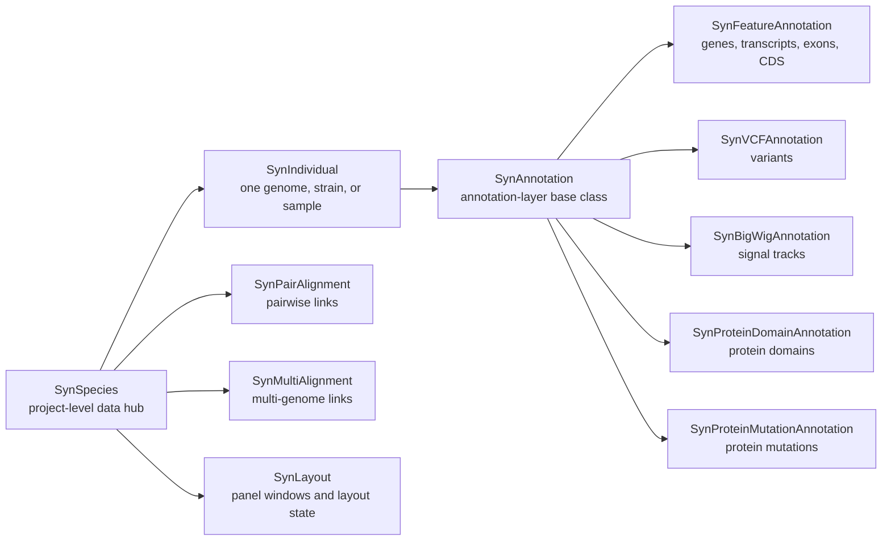

```{r, include = FALSE}
knitr::opts_chunk$set(
  collapse = TRUE,
  comment = "#>"
)
```

# Overview

`ggexon` separates data storage from plotting. S4 classes remember genomes,
annotation layers, alignments, trees, and layout decisions. Verbs then load,
query, subset, curate, and draw those objects.

The package is easiest to learn in this order:

1. data-storage classes
2. plot entry point and geoms
3. facet systems and genomic guides
4. verbs that manage, query, and transform stored data

# Data-storage classes

The object model keeps stable biological identifiers for computation while
allowing readable labels and plot-specific layout state to be stored
separately.



## Project and genome containers

`SynSpecies` is the project-level container. It stores the individuals being
compared, pairwise or multiple alignments between them, optional trees, and
reusable layout state.

```{r eval = FALSE}
sp <- SynSpecies(name = "Caenorhabditis")
```

`SynIndividual` stores one genome, strain, species, or sample. It can remember
the genome FASTA, feature annotation file, loaded annotation layers, sequence
caches, labels, patches, and feature indexes.

```{r eval = FALSE}
xz <- SynIndividual(
  genome_file = "XZ1516.fasta",
  annotation_file = "XZ1516.gff3",
  id = "XZ1516"
)
```

At construction time, `ggexon` checks whether sequence names in the annotation
file exist in the FASTA headers.

## Annotation-layer classes

`SynAnnotation` is the shared base class for data layers attached to a
`SynIndividual`.

The main concrete annotation classes are:

| Class | Stores |
| --- | --- |
| `SynFeatureAnnotation` | Structural genome annotation such as genes, transcripts, exons, CDS, labels, and patch history |
| `SynVCFAnnotation` | Variant data queried by genomic region |
| `SynBigWigAnnotation` | Signal tracks queried by genomic region |
| `SynProteinDomainAnnotation` | Protein-space domains from InterProScan-like tables |
| `SynProteinMutationAnnotation` | Protein mutation summaries and lollipop-track inputs |
| `SynAnnotationPatch` | Small gene-model corrections that add, drop, or replace features |

Additional layers are attached to a `SynIndividual` with `add_annotation()`.

```{r eval = FALSE}
xz <- add_annotation(
  xz,
  SynVCFAnnotation(
    name = "variants",
    vcf_file = "sample.vcf.gz"
  )
)

xz <- add_annotation(
  xz,
  SynProteinDomainAnnotation(
    name = "interpro",
    domain_file = "InterProScan.tsv",
    keytype = "protein_id",
    source_db = "InterPro"
  )
)

xz <- add_annotation(
  xz,
  SynBigWigAnnotation(
    name = "coverage",
    bigwig_file = "coverage.bw"
  )
)
```

## Alignment, homology, and layout classes

Comparative relationships and cross-species gene mappings are stored at the
`SynSpecies` level:

- `SynPairAlignment` stores one pairwise relationship between two individuals.
  Supported inputs include PAF, PSL, and ODGI-derived pairwise links.
- `SynMultiAlignment` stores a multiple alignment across more than two
  individuals. Supported inputs include MAF and ODGI-backed graph data.
- `HomologyAnnotation` stores cross-species gene homology mappings, typically
  derived from BLAST results. It maps gene identifiers from a query species
  to gene names in a reference (center) species. When attached to a
  `SynSpecies`, `geom_genelabel()` can use these mappings to label query-species
  genes with their reference-species ortholog names.
- `SynLayout` stores reusable panel windows and layout state so plots can be
  rebuilt from the same coordinate decisions.

### Building homology from BLAST

```{r eval = FALSE}
sp <- SynSpecies(name = "worms")

# Import a BLAST outfmt 6 result (one species → reference)
# The gene_id_map translates N2 locus tags (B0250.1) to gene names (calf-1)
ha <- import_blast_homology(
  blast_file = "C_bovis.subset.proteins.blast6",
  reference_species = "C. elegans",
  query_species = "C. bovis",
  gene_id_map = "c_elegans.PRJNA13758.WS285.geneIDs.txt"
)

# Attach to SynSpecies
sp <- add_homology_annotation(sp, ha)

# Inspect the mapping
homology_table(ha)
reference_species(ha)
query_species(ha)
```

The BLAST query IDs are automatically normalised: `transcript:` prefixes and
`.t1` isoform suffixes are stripped so that query gene identifiers match the
`gene_id` / `gene_name` columns in your GFF3 annotations.

The `gene_id_map` translates reference-species locus tags (N2 protein IDs
like `B0250.1`) to human-readable gene names (like `calf-1`). It accepts
either a file path to a WormBase WS285 `geneIDs.txt` or a named character
vector. Isoform suffixes are stripped on lookup miss (e.g. `B0250.18a` →
`B0250.18`). Unmapped tags are left unchanged.

### Using homology for gene labels

When `SynSpecies` holds homology annotations, `geom_genelabel()` can apply
reference-species gene names automatically.

```{r eval = FALSE}
# Build homologies for all query species
for (sp_name in query_species) {
  ha <- import_blast_homology(
    blast_file = paste0(sp_name, ".blast6"),
    reference_species = "C. elegans",
    query_species = sp_name,
    gene_id_map = "c_elegans.PRJNA13758.WS285.geneIDs.txt"
  )
  sp <- add_homology_annotation(sp, ha)
}

# Auto-match: each track gets its homology by query_species
ggexon(sp) +
  geom_genetag(chr = "V", feature_type = "gene", mapping = aes(fill = gene)) +
  geom_genelabel(chr = "V", size = 2.4) +  # no homology_name — auto-match
  facet_genomictree(vars(track), scales = "free")
```

When `homology_name` is omitted and the `SynSpecies` contains homology
annotations, each track automatically finds the matching `HomologyAnnotation`
by its `query_species` field. For a single explicit mapping, set
`homology_name = "bovis_to_n2"`.

```{r eval = FALSE}
sp <- add_individual(sp, xz)

sp <- add_pairwise_alignment(
  sp,
  SynPairAlignment(
    name = "XZ1516_vs_N2",
    query_individual = "XZ1516",
    target_individual = "N2",
    file = "XZ1516_vs_N2.paf"
  )
)

sp <- add_multiple_alignment(
  sp,
  SynMultiAlignment(
    name = "worm-maf",
    individuals = c("XZ1516", "N2", "CB4856"),
    file = "worms.maf"
  )
)
```

# Plot entry point and geoms

`ggexon()` starts a plot like `ggplot()`, but it understands `SynIndividual`
and `SynSpecies` objects. Geoms can resolve stored annotation or alignment data
at build time.

```{r eval = FALSE}
ggexon(sp) +
  geom_exon(
    species = "XZ1516",
    chr = "RagTag_V",
    subset = c(21574445, 21584356)
  )
```

## `geom_exon()`

Use `geom_exon()` when transcript structure matters. It draws exon rectangles,
the transcript backbone, and strand direction from feature annotation data.

```{r eval = FALSE}
ggexon(sp) +
  geom_exon(
    species = "XZ1516",
    chr = "RagTag_V",
    subset = c(21574445, 21584356)
  )
```

## `geom_exon2()`

Use `geom_exon2()` for exon/CDS/UTR-style tracks with compressed intron display.
This is useful when the visual emphasis is on coding and untranslated segments
rather than raw genomic spacing.

```{r eval = FALSE}
ggexon(sp) +
  geom_exon2(
    species = "XZ1516",
    chr = "RagTag_V",
    subset = c(21574445, 21584356)
  )
```

## `geom_genetag()`

Use `geom_genetag()` when each gene should be represented as one directional
span. This is a compact overview layer for synteny figures.

```{r eval = FALSE}
ggexon(sp) +
  geom_genetag(
    species = "XZ1516",
    chr = "RagTag_V",
    subset = c(21574445, 21584356)
  )
```

## `geom_genelabel()`

Use `geom_genelabel()` to place readable names above or below a gene track.
Labels come from the stored feature annotation, so stable gene IDs can remain
unchanged while plot labels are curated separately.

For cross-species plots, the `homology_name` parameter (or auto-match via
stored `HomologyAnnotation` objects) can replace each query-species gene label
with its reference-species ortholog name.

```{r eval = FALSE}
ggexon(sp) +
  geom_genetag(species = "XZ1516", chr = "RagTag_V") +
  geom_genelabel(
    species = "XZ1516",
    chr = "RagTag_V",
    label_direction = "top",
    homology_name = "xz1516_to_n2"   # use N2 gene names
  )
```

### Label positions

The `label_direction` parameter accepts colon-delimited combinations of
`"top"`, `"bottom"`, and `"center"`. Labels are distributed across positions
by track-index modulo:

- `"top"` — all labels above the highest track.
- `"bottom"` — all labels below the lowest track.
- `"top:bottom"` — odd-indexed rows above, even-indexed below.
- `"bottom:top:center"` — three-position rotation. Centre labels are placed
  on the gene body when the text fits; otherwise they fall back to `"top"`.

```{r eval = FALSE}
geom_genelabel(label_direction = "top:center:bottom")
```

### Leader lines

`geom_genelabel()` draws leader lines from each gene body to its label.
Control the line style with `link_type`:

- `"straight"` — direct line (default).
- `"elbow"` — right-angle bend (vertical then horizontal).
- `"spline"` — smooth Bézier curve.

Suppress leader lines with `show_link = FALSE`. Use `label_offset_fraction`
(default `0.3`) to adjust the vertical gap between tracks and labels.

### Tandem collapsing

When `collapse_tandem = TRUE`, consecutive genes with identical labels
(e.g. tandem duplications) share a single label connected to all gene bodies
by a bracket-style connector.

### Panel width for accurate label spacing

`geom_genelabel()` estimates text width in data coordinates to avoid label
overlaps. By default it assumes a ~300 mm wide genomic panel. For wide output
(e.g. `ggsave(width = 40, ...)`), set `panel_width_mm` or `panel_width_inch`
to the actual genomic track column width so spacing is accurate:

```{r eval = FALSE}
# Genomic tracks are ~38 inches wide (40 in total minus tree and labels)
geom_genelabel(
  chr = "V", size = 2.4,
  panel_width_inch = 38
)

# Equivalent in millimetres
geom_genelabel(
  chr = "V", size = 2.4,
  panel_width_mm = 38 * 25.4   # = 965.2
)
```

When both are provided, `panel_width_inch` takes precedence.

## `geom_genomic_tree()`

Use `geom_genomic_tree()` for genomic tree structures inside ggexon panels. It
is intended for figures where tree-like relationships need to share the same
panel system as genomic intervals.

```{r eval = FALSE}
ggexon(tree_data) +
  geom_genomic_tree()
```

## `geom_motif()`

Use `geom_motif()` for motif, domain-like, or other interval blocks. It is a
general interval layer when the data are already in a plot-ready table.

```{r eval = FALSE}
ggplot(motif_data) +
  geom_motif(aes(xmin = start, xmax = end, y = track, fill = motif))
```

## `geom_mutation_label()`

Use `geom_mutation_label()` when mutation labels need to be placed on sequence
or protein tracks.

```{r eval = FALSE}
ggplot(mutation_data) +
  geom_mutation_label(aes(x = position, y = track, label = mutation))
```

## `geom_nuclink()`

Use `geom_nuclink()` for nucleotide-level links between aligned genomes. With a
`SynSpecies` object, the geom can resolve stored pairwise alignments.

```{r eval = FALSE}
ggexon(sp) +
  geom_exon(
    species = c("XZ1516", "N2"),
    chr = "RagTag_V",
    subset = c(21574445, 21584356)
  ) +
  geom_nuclink(
    reference = "XZ1516",
    chr = "RagTag_V",
    subset = c(21574445, 21584356),
    alignment = "XZ1516_vs_N2"
  )
```

## `geom_synteny_link()`

Use `geom_synteny_link()` when links represent gene-level synteny, orthology,
or another interval-to-interval biological relationship rather than a raw
nucleotide alignment fragment. The expected table columns are the same as
`geom_nuclink()`: target interval columns (`tspecies`, `tchr`, `tstart`,
`tend`), query interval columns (`qspecies`, `qchr`, `qstart`, `qend`), and
`strand`.

```{r eval = FALSE}
ggexon(sp) +
  geom_genetag(species = c("human", "macaque"), chr = "HOXA") +
  geom_synteny_link(
    data = hoxa_links,
    aes(fill = orthology_group),
    alpha = 0.35
  ) +
  facet_genomics(ggplot2::vars(track), scales = "free")
```

Internally, `geom_synteny_link()` uses the same panel-aware polygon renderer as
`geom_nuclink()`. `facet_genomics()` creates annotation panels and middle link
panels, the link layer turns each target/query interval pair into four polygon
vertices, and each side of the ribbon is transformed against the x scale of its
own source genomic panel before being drawn in the link panel.

## `geom_protein_lollipop()`

Use `geom_protein_lollipop()` for protein-domain backbones with mutation
lollipops. It is usually paired with protein-domain or protein-mutation helper
data.

```{r eval = FALSE}
ggplot(protein_lollipop_data) +
  geom_protein_lollipop(
    aes(x = position, y = protein_id, label = mutation)
  )
```

## `geom_aa_variant()`

Use `geom_aa_variant()` to annotate amino-acid variants (for example `C316H`)
directly on the exon/intron model, rather than on the linear protein track that
`geom_protein_lollipop()` draws. When the plot data is a `SynIndividual` or
`SynSpecies`, the layer resolves an attached `SynProteinMutationAnnotation`,
projects each variant onto its transcript's CDS with
`project_mutations_to_genome()`, and draws a lollipop sitting above the matching
exon row. Each variant is treated as one codon (residue `p` maps to CDS
nucleotides `(p - 1) * 3 + 1 .. p * 3`); the projection is strand-aware, places
codons that cross a splice junction on the correct exonic base, and honours the
5'-most CDS phase for 5'-truncated models. It shares this projection core with
`geom_motif()`.

```{r eval = FALSE}
# Attach a protein-coordinate variant summary keyed to genes. The mutation
# column accepts `C#316#H` hash notation or plain `C316H` strings.
xz <- add_protein_mutation_annotation(
  xz,
  mutation_file = "zina_variants.tsv",
  keytype = "gene_id"
)

ggexon(xz) +
  geom_exon(chr = "RagTag_V", subset = c(21574445, 21584356)) +
  geom_aa_variant(
    aes(fill = sample_count),
    chr = "RagTag_V",
    subset = c(21574445, 21584356)
  )
```

Variant metadata columns (`position`, `ref`, `alt`, `mutation`,
`sample_count`, ...) are exposed for aesthetics, and `query_protein_mutations()`
filters such as `genes`, `strains`, `event_type`, `min_sample_count`, and
`protein_ranges` can be passed straight to the layer. `stem_height` and
`y_offset` adjust where the marker sits relative to the exon row.

To obtain the projected genomic coordinates as a table — to drive a custom
marker or to export the codon positions — call `project_mutations_to_genome()`
directly. A codon that straddles an intron returns one row per exonic fragment.

```{r eval = FALSE}
project_mutations_to_genome(xz, chr = "RagTag_V", start = 21574445, end = 21584356)
```

# Facets, tree alignment, and guides

`ggexon` uses facet systems to keep genomic panels, alignment links, trees, and
other plots in register.

## `facet_genomics()`

`facet_genomics()` arranges genomic annotation panels, link panels, signal
tracks, and other data panels in one ggplot-like layout.

```{r eval = FALSE}
ggexon(sp) +
  geom_exon(species = c("XZ1516", "N2"), chr = "RagTag_V") +
  geom_nuclink(
    reference = "XZ1516",
    chr = "RagTag_V",
    alignment = "XZ1516_vs_N2"
  ) +
  facet_genomics(ggplot2::vars(track), scales = "free_y")
```

## `facet_genomictree()`

`facet_genomictree()` is for genomic panels aligned to a tree or another
reference plot. Tree workflows are supported by helpers such as
`compile_ggtree_genetag()`, `compile_ggtree_genomic_alignment()`,
`compile_ggtree_rectangular_segments()`, and
`plot_ggtree_genomic_alignment()`.

```{r eval = FALSE}
plot_ggtree_genomic_alignment(
  sp,
  alignment = "worm-maf",
  chr = "RagTag_V"
)
```

### Column layout

`facet_genomictree()` lays out three columns left to right: tree, species
labels, and genomic track panels. Each column has a dedicated width
argument:

| Column | Argument | Default |
|---|---|---|
| Tree | `tree_width` in `geom_genomic_tree()` | `unit(1.5, "in")` |
| Labels | `label_width` in `facet_genomictree()` | `unit(0.7, "in")` |
| Tracks | `track_width` in `facet_genomictree()` | `NULL` (fills remaining space) |

Species labels can be placed on the left (`label_position = "left"`, default),
right (`"right"`), or hidden (`"none"`).

```{r eval = FALSE}
# Explicit column widths
facet_genomictree(
  label_position = "left",
  label_width = unit(0.6, "in"),
  track_width = unit(1, "null")  # ratio: tree=1.5in fixed, tracks fill rest
)

# Fixed track width for a known output size
facet_genomictree(
  track_width = unit(38, "in")   # genomic panel is 38 inches wide
)
```

When `track_width` is `NULL` (default), the track panel columns keep their
facet-default widths (typically `unit(1, "null")` filling remaining space).
Set it to a `"null"` unit to control the ratio between tree and tracks, or
to a fixed unit when the output dimensions are known in advance.

## Genomic scales and the piecewise guide

`scale_x_ggexon_genomic()` keeps genomic coordinate labels while supporting
compressed regions. The guide `guide_x_ggexon_piecewise()` shows separate exon
and intron scale bars instead of ordinary genomic ticks.

```{r eval = FALSE}
ggexon(sp) +
  geom_exon(species = "XZ1516", chr = "RagTag_V") +
  scale_x_ggexon_genomic(
    guide = guide_x_ggexon_piecewise()
  ) +
  facet_genomics(ggplot2::vars(track), scales = "free_y")
```

Use this guide when a figure mixes detailed exon-scale interpretation with
compressed intronic or intergenic distances.

# Verbs that manage stored data

The function families follow one rule: use classes to remember the data, then
use verbs and geoms to operate on those classes.

## Build the object graph

Use `add_*()` functions when a parent object should remember a child object,
annotation layer, alignment, tree, or layout result.

```{r eval = FALSE}
sp <- SynSpecies(name = "Caenorhabditis") |>
  add_individual(xz, n2) |>
  add_tree(tree)

sp <- add_multiple_alignment(
  sp,
  SynMultiAlignment(
    name = "worm-maf",
    individuals = c("XZ1516", "N2", "CB4856"),
    file = "worms.maf"
  )
)
```

Common graph-building functions include `add_individual()`,
`add_individuals_from_folder()`, `add_annotation()`,
`add_pairwise_alignment()`, `add_multiple_alignment()`, `add_tree()`,
`add_genetag()`, `store_chain_layout()`, and `store_projected_domains()`.

## Load, query, and derive data

Use `load_*()` when the object knows where a file is, but the data have not
yet been materialized.

```{r eval = FALSE}
xz <- load_annotation(xz)
sp <- load_alignment(sp, alignment = "XZ1516_vs_N2")
```

Use `query_*()` and `*_data()` helpers when you want rows or ranges back:

```{r eval = FALSE}
features <- query_features(
  xz,
  chr = "V_RagTag",
  start = 21574445,
  end = 21584356,
  feature_type = "gene"
)

links <- pairwise_alignment_data(
  sp,
  alignment = "XZ1516_vs_N2",
  subset = c(
    XZ1516 = "RagTag_V:21574445-21584356",
    N2 = "V:20456000-20465040"
  )
)
```

Other data verbs include `query_variants()`, `query_signal()`,
`query_domains()`, `query_protein_mutations()`, `extract_cds_seq()`,
`translate_protein()`, `project_domains_to_genome()`, and
`project_mutations_to_genome()`.

## Modify, subset, and curate objects

Use `subset_*()` and `filter_*()` when you want updated objects or filtered
alignment state.

```{r eval = FALSE}
sp_window <- subset_species(
  sp,
  coords = c("XZ1516#V_RagTag:21574445-21584356")
)

sp_window <- subset_pairwise_alignment(
  sp_window,
  alignment = "XZ1516_vs_N2",
  subset = c(
    XZ1516 = "RagTag_V:21574445-21584356",
    N2 = "V:20456000-20465040"
  )
)
```

Use curation verbs when a feature annotation needs readable labels or corrected
gene models:

```{r eval = FALSE}
xz <- set_gene_labels(
  xz,
  c(FUN_000001 = "sept-1", FUN_000002 = "zina-1")
)

xz <- patch_annotation_from_gff(
  xz,
  patch_file = "XZ1516.corrected.gff3",
  mode = "replace",
  name = "manual-curation"
)
```

Patch modes include `replace`, `add`, and `drop`. Patch history can be
inspected with `list_patches()` and cleared with `clear_patches()`.

# Recommended workflow

A typical `ggexon` workflow is:

1. create one or more `SynIndividual` objects
2. load each active feature annotation
3. attach optional VCF, BigWig, protein-domain, or mutation layers
4. set readable plot labels while keeping stable biological IDs
5. patch corrected gene models if needed
6. derive CDS, protein, or projected-domain data
7. collect individuals inside a `SynSpecies`
8. attach pairwise or multiple alignments
9. draw geoms and arrange panels with `facet_genomics()` or
   `facet_genomictree()`
10. use `guide_x_ggexon_piecewise()` when compressed genomic axes need explicit
    exon and intron scale bars

# See also

- `vignette("ggexon-workflow", package = "ggexon")`
- `?ggexon`
- `?facet_genomics`
- `?guide_x_ggexon_piecewise`
